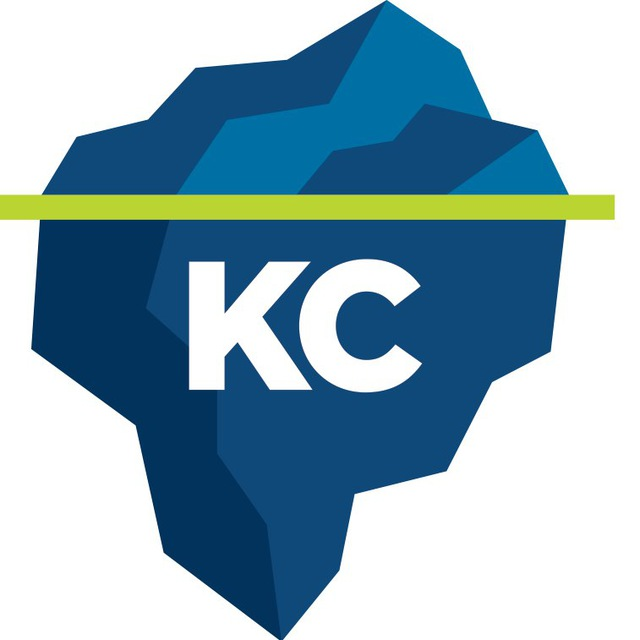

 <a href = "https://teamleadconf.ru">TeamLeadConf</a>
 <a href = "https://knowledgeconf.ru">KnowledgeConf</a>
 <a href = "https://t.me/docops">@docops</a>

# OKR: инструкция по применению

Егор Толстой, Avito

Общая частая проблема:

* неизвестно, что делают чужие команды
* непонятно, как моя команда вкладывается в успех бизнеса

OKR помогает понимать друг друга и вместе работать на общий результат.
Для справки, медианный результат по Авито — 0.6.
Конечно, не всё и везде работает ровно.

План доклада:
* ликбез
* как начать
* ставим цели
* достигаем цели.

Будут практические примеры: что делать и как получить пользу.

# Ликбез

OKR — система целеполагания, которая выстраивает дерево целей от компании по отделам и командам.

Цель определяет ключевую ценность для бизнеса. Отвечает на вопрос что и зачем.

Ключевой результат определяет измеримость цели.

Например, на уровне компании:

* Цель — обеспечить устойчивый рост.
* КР — выполненпие плана по выручке и выполнение плана по buyers. 

В конкретном отделе:

* Цель: увеличить долю рынка в Авто
* КР: рост количества покупателей новых авто.

И на уровне команды

* Цель: ускорить доставку ценности
* КР: ...

Важно: ОКР — это не про деньги.
Если сделать про деньги, появится микроменеджмент, культура подозрительности и симуляция.

Важно: цели должны быть амбициозными и достижимыми.

Важно: результаты должны быть измеримыми.

Важно: цель — это проблема, а не решение. Не сработает одно решение — будем пробовать другое.

Цели должны быть связаны между командами. Все работают на один результат.

Команды сами выставляют свои цели, потому что сами лучше всех знают свои задачи и клиентов.

Публичность! Всё открыто, все смотрят на ОКРы друг друга.

На деле всё не так просто, конечно же.

# Как начать

Лучше всего с одной конкретной команды.
Эта команда должна быть максимально приближена к полю боя. 

Отправили инженера Женю учиться ОКРам в Гугл.
Он вернулся и внедрил ОКР в команде.
Через некоторое время команда получила первые хорошие результаты.
Стали внедрять на соседние команды и дальше по компании.

Хорошо, если команда состоит из зрелых сотрудников, сыгранных между собой.
Команда должна быть способна контрибьютить в любые части системы.
Если команда делает только бэк или фронт, ей будет тяжело.
Чем больше внешних связей, тем сложнее тащить ОКР.

Важно продать команде ОКР.
Ребята должны уже страдать от расфокусировки и непонятности целей.
Тогда они будут замотивированы.

## Как внедрять

1. Определить цели
1. Провести пилотный проект на одной команде
1. Подключить ещё команды
1. Добавить ОКР компании
1. Связать все ОКР

# Ставим цели

Вот вы тимлид команды. С чего начать?

Найдите идентичность команды. Кто вы в компании, что вы делаете?

* Миссия команды. Зачем мы существуем?
* Долгосрочные цели. Чего должна добиться команда в течение года-двух.
* Направления работы. Куда нам двигаться.

Например, так: 

## Objectives

Цель:

* Берётся не из ниоткуда. Сразу понятно, почему именно мы это делаем.
* Без точных числовых показателей. Просто направление.
* Хорошо запоминается. Так бывет, когда цель сформулирована четко и ясно.

    Хорошо: порвать крейгслист
    
    Плохо: добиться значимого конкурентного преимущества блаблабла классифайд бла бла.

* Не буллшит и не канцелярщина. Нормальным языком, которым живые люди разговаривают в жизни.

    Плохо: энейблить эффективную индикацию.
    
    Хорошо: ловить проблемы.

* По цели может быть прогресс за реальное время.

    Плохо: выйти на рынки всех стран мира.
    
    Хорошо: выйти на рынок ближнего востока.
    
* Цель понятна всем. Например, сеошнику Владимиру Правдивому. Поэтому цель выражается в общих терминах бизнеса.

## Key results

Постановка ключевых результатов

* Суть: переводят цель в числа
* Но не бинарные! Бинарные никогда не будут достигнуты на 100%. В идеале — непрерывная метрика, которую можно измерять максимально часто.
* Команда влияет на эти результаты. Если на них влияет ещё и другая команда, будет плохо.

    Плохо: NPS. Очень инерционный параметр. Изменится этак через квартал после того, как выпустили фичи, которые на него повлияют.
    
    Хорошо: retention, меняется сразу.
        
* Отражают результат, а не прогресс.
    Можно разделить на два КР: прогресс и результат.
    Например, реализация проекта и изменение показателей от него.
    
    
## Мифы и заблуждения

* «Цели должны меняться каждый квартал, иначе мы неудачники». Конечно нет.
* «Мы уже знаем, что делать, надо просто завернуть это в ОКР». Тут надо смотреть, насколько все-таки этот проект ложится на цели команды. 
* «В ОКР надо отражать всё, что делает команда. Включая саппорт, починку багов и проведение хакатонов». Нет. Разделяйте операционку и создание ценности. В ОКР — только про ценность.
* «Наша цель — научиться измерять.» Это не плохо, но не факт, что стоит это выносить в ОКР.
* «Цель уже неактуальна, но мы ее доделываем, потому что ОКР!». Пересмотрите цели и двигайтесь дальше по другим.
* «Бесит ставить цель, которую я сразу знаю, что не выполню.» Ок, не ставь совсем недостижимую цель. Или подумай, как всё-таки достичь.
* «Цели ставить продакт, а мы просто выполняем.» Если команда не участвует в работе над ОКР, то она может и не принять эти цели. А ещё команда лучше всех знает свою работу.

## Как организован процесс

### Первая встреча.

За три недели до конца периода.
Цель: синхронизироваться и накидать идеи.

1. Вспоминаем миссию и цели.
1. Брейнштормим objectives, key results, инициативы.

### Доработка черновика.

Цель: выбрать главное и вровняться с другими.

1. Формируем первый черновик.
1. Челленджим, почему и как
1. Грумим и оцениваем инициативы
1. Синхронизируем с другими командами.

### Финализируем результат.

Цель: коммитмент. Взять ответственность.

1. Полируем формулировки.
1. Замораживаем файл с ОКР.

## Советы по планированию ОКР.

* Ритм! Придерживайтесь общего расписания во всех командах.
* Синхронизация. Уделите достаточно внимания другим командам. Челленджите их ОКРы, задавайте вопросы.
* Оценка. Не коммитьтесь вслепую, составляйте бэклог, сразу придумывайте пути достижения.

## Итоги

1. Начните с долгосрочных целей
1. Научитесь формулировать О и КР
1. Выстройте ритмичный процесс работы.

# Достигаем цели

## Что делать

OKR Review. Собираемся, смотрим и задаем вопросы.

Сводный дашборд результатов все команд.

Цели спринтов берутся из ОКР. В целях спринта всегда должна быть цель из ОКР. Конечно, может быть и другие.

Почему фейлы:

* Навалился саппорт, операционка, баги. В этом случае надо работать над долгосрочными целями и процессами.
* Достигли результатов, просто метрики плохие. Ок, в следующий раз берем хорошие КР и метрики.
* Взяли слишком или недостаточно амбициозные цели. Ок, принимаем к сведению и в следующий раз планируем лучше.

Не летите по приборам! Ругайте и награждайте за реальные результаты.

## Итоги

1. Следите за метриками
1. Интегрируйте с рабочим процессом команды
1. Анализируйте причины успехов и провалов.

# Польза для себя

* Даёт фокус и челлендж для сеньоров.
* Всё в одном месте, проще онбордить сотрудников. 
