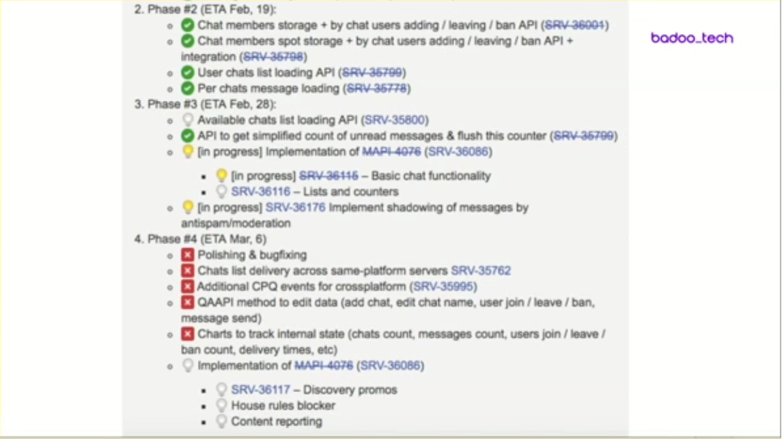

 <a href = "https://teamleadconf.ru">TeamLeadConf</a>
 <a href = "https://knowledgeconf.ru">KnowledgeConf</a>
 <a href = "https://t.me/docops">@docops</a>

# Работа со сроками как часть инженерной культуры

Николай Крапивный, Badoo

Конфликт: скорей делать, хоть и спонтанно, или тратить время на планирование?

К срокам относятся как к монстру, который придёт и сделает больно. А хочется по-другому.

В докладе:

* Почему полезно ставить сроки
* Работа со сроками как инстурмент тимлида

Конкретно:

* Быть или не быть срокам
* Как это работает
* 7 советов тимлида

Заказчик в терминах доклада — внутренняя продуктовая команда. Но в целом это всё работает и для внешнего заказчика.

# Быть или не быть срокам

## Что такое срок?

Разработчик говорит «Первого марта будет готово», но имеет в виду, что первого марта:

* отдаст в тестирование
* код уйдёт на прод
* что угодно ещё,

но фича не будет доступна пользователям.

Так вот, срок задачи — когда фича выпущена.

## Работа по срокам:

* Приёмка — согласовываем требования
* Оценка — ставим срок
* Работа — отслеживаем прогресс
* Ретроспектива — рефлексируем

Работа по срокам — это полезный инструмент тимлида.

## Зачем прорабатывать сроки?

* Счастливый заказчик (и от этого счастливый тимлид).
* Обратная связь и постоянное улучшение
* Проработка задачи.

  Когда надо поставить срок, приходится продумать задачу до конца. Конечно, могут быть непредвиденные проблемы, но мы всё равно минимизируем их риск.
  
* Рост и развитие команды.

  Делегирование разработчикам полного ведения работы по срокам — это крутой инструмент их развития!
  
  Пускай все четыре аспекта работы по задаче делает разработчик. Так он становится совладельцем задачи и заинтересован в её успехе. И это исключает все «я свою часть сделал, это виноваты другие...».

## Зачем всё это тимлиду?

Мы хотим, чтобы команда состояла из крутых самостоятельных спецназовцев, которые понимают общую цель.

## За что всё это разработчику?

Нормально же работал!

А вот зачем:

* Разработчик получит +100500 к soft skills. Это хорошо для тех, кто хочет развивать эту сторону.
* Такой подход развивает инженеров, а не программистов.

  Разница: решить задачу, а не писать код. Идеальный вариант — когда кода нет, а задача решена. Такие люди ценнее и дороже стоят на рынке.
  
## Результат

Ситуация win-win. Хорошо компании, тимлиду и разработчику.

Так, а зачем тогда нужен тимлид? Он перестаёт быть операционным управляющим и занимается поддержкой: формирует команду, менторит, помогает, мотивирует и развивает, но не работает вместо людей. Как футбольный тренер.

## Всё так идеально, не хватает только розовых пони. Где проблемы?

Проблема 1: найм. На собеседовании гораздо сложнее проверить софт-скиллы, чем технические навыки.

Проблема 2: адаптация. Ввести такого человека в строй — сложный путь. Приходится изучать не только техническую часть, но и процессы, людей и связи.

NB: есть [отдельный доклад про онбоардинг в Badoo](http://bit.ly/badoo_onboarding)

## Итог

* Срок = приемка, оценка, работа и ретро
* Сроки полезны для лида, не только для заказчика
* Делегируем: разработчик отвечает за все стадии 
* Растим: лид менторит и помогает

# Как это всё работает на самом деле

Есть большой бэклог: гипотезы, идеи, проблемы.

Работа над задачей начинается со знакомства. В него входит:
* Изучение требований и целей
* Примерная оценка сложности
* Выявление вопросов.

Чеклист для kick-off встречи:

* Какая цель задачи? Какой критерий успеха?
* Требования согласовать и обновить
* Прояснить все вопросы
* Коммуникация: кто, как и когда

Оценка задачи (разработчик ставит срок)

* Технический план: что нужно сделать
* Зависимости
* Весь цикл до продакшена: ревью, QA, выкладка

Ревью срока. Этот этап может инициировать разработчик или тимлид. Цель — понять, насколько хорошо выполнена работа по согласованию.

Осторожно: тут у тимлида будет острое желание вмешаться, переделать и поменять сроки. В этот момент тимлид возьмёт ответственность за срок на себя, а разработчик перестанет быть ответственным. Не надо так.

Пример работы над задачей по чеклисту:

Поля в джире:

* Due date — текущий актуальный срок по задаче
* Situation — описание ситуации, если оно необходимо

Меняем due date — пишем причину в situation. Потом смотрим в журнал изменений и рефлексируем.

# 7 cоветов тимлида

Что мы говорим разработчикам, чтобы помочь им справиться с работой со сроками.

Совет 1. Стремись к минимальным достаточным требованиям.

Совет 2. Выбирай оптимистичный срок, предупреди об этом заказчика. Такой, в который не заложены разные проблемы. 

  Если сотрудничество долгосрочное, то заказчик заинтересован в том, чтобы сроки были оптимистичными и исполнитель делал выводы, если не попадает в оценку.
  
Совет 3. Балансируй время и требования.

Ограничения: время и требования. Тут могут быть варианты.

* Срок и требования не зафиксированы. Фиксируем минимальные требования сами.
* Жесткие требования — ставим срок.
* Жесткий срок — срезаем требования, говорим что сможем успеть в этот срок.
* Жесткий срок и жесткие требования. Вынуждены «взять кредит у банка технического долга». Сделать костыльное решение, но сделать его в срок.

Совет 4. Раскрываем неопределённости в первую очередь через итеративную работу.

Неопределённость — враг хорошего срока. Вот что мы с ней делаем:

* Намечаем варианты решения и общий план
* Действуем итеративно
* Срок по каждому шагу
* Корректируем план после каждого шага

Совет 5. Если в задаче важен результат для бизнеса, используй проверенные решения

Инновации! Все любят новые фреймворки и технологии. «Классная задача, я как раз читал статью на хабре, щас я тут попробую».

Инфраструктура:

* Готовые кубики — фреймворки, решения, подходы
* Наработанный опыт = минимум сюрпризов
* Технический радар: hold, assess, trial, adopt
* Инновации — отдельно

Совет 6. Оценивай задачу по кускам.

Когнитивные искажения.

Человек занижает время, необходимое на выполнение любой работы.

Решение — сегментирование. Сумма оценок кусков будет больше, чем оценка задачи целиком.

Совет 7. Здравый смысл важнее процессов.

Бывает, что установленный в компании процесс мешает сделать задачу эффективно, потому что противоречит здравому смыслу.

Совет тимлиду: не наказывай, а делай выводы.

Если наказывать разработчика за нарушение сроков, он будет ставить пессимистичный срок, чтобы точно попасть.

# Итоги

1. Срокам — быть
1. Рассказал, как мы это делаем
1. Семь советов разработчику и один тимлиду
